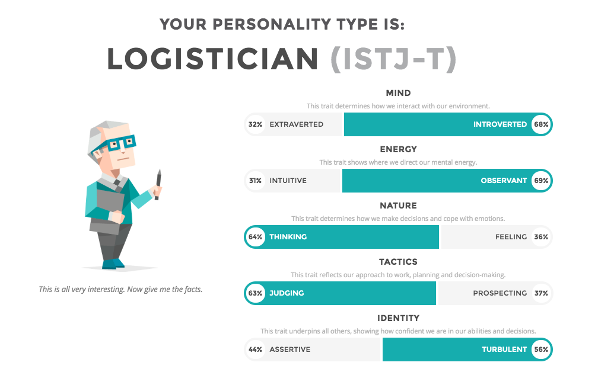
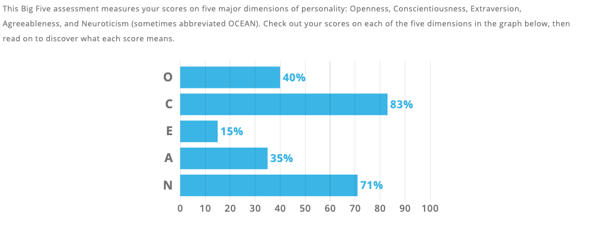
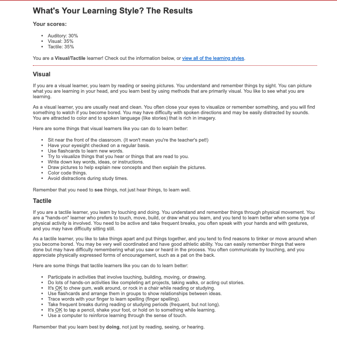

<html>

<head>
  <h1> Group Assignment website </h1>
</head>
   <body>

  <h2> Links to each individual website </h2>
  
<a href="https://vincentsingzon.github.io/myprofile/">Link to Vincent Singzon Profile</a>
My name is Vincent Singzon my student ID is S3818849, I’m from Sydney Australia and my background is Filipino, my hobbies include things such as gaming, going out, art and working out. II joined this course as I have an interest in IT due to my hobby of playing games and my Dad who also works in IT related field. The IT field I'm particularly in is Cybersecurity which I hopefully get employed in, my experience includes a completion of a Cert IV Networking course in Tafe and some programming, along with this course.

 

<a href="https://kgm95.github.io/My-Profile/">Link to Kyle Molloy Profile</a>
My name is Kyle my student ID is s3817419, I’m from the from the Sunshine Coast, my hobbies include things such as playing video games, building computers, gym and watching movies. I joined this IT course to widen my horizons when it comes to the IT field, my interest developed when I was young as my father taught me how to build and installing software on computers. I hope to gain plenty of experience which can be used towards developing a career in this industry.

<a href="https://bburke2.github.io/MyProfile/">Link to Bradley Burke Profile</a>

<a href="https://keetansouthwell.github.io/ITP-Assignment-1/">Link to Keetan Southwell Profile</a>
My name is Keetan Southwell, my student ID is 795652, my email address is keetan.southwell@gmail.com. I am a year 10 student and live on the North Shore of Sydney. I was born in Canada and moved to Sydney when I was 7. I have one Golden Retriever named Ryder. My hobbies include basketball, video games and puzzles.

<a href="https://github.com/WillDaWise/Assignment1/wiki">Link to Will Grime Profile</a>
I’m Will Grime and my student number is s3795662. I am a year 10 student at St Ives High School in the Sydney North area. I enjoy video games and basketball. I enjoy coding, and my IT experience is just my IT electives at school, along with Intro to programming and programming 1 from RMIT which I have just completed. 
<h2> Team Profile </h2>
<h3> Keetan Southwell </h3>

 
<h3> Will Grime </h3>

 
<h3>Vincent Singzon</h3>

 
<h3>Kyle Molloy</h3>
[url=https://ibb.co/FVNy5DW][img]https://i.ibb.co/FVNy5DW/index.png[/img][/url]

 
<h3>Aaron Wilkinson </h3>

<h2> Ideal Jobs </h2>
<h3> Vincent Singzon </h3>
 My Ideal job was Cyber Security Engineer The common element I found in this was the relations to IT field. The thing which differentiates my position from others is protecting damage to hardware, software, or electronic data, as well as from the disruption or misdirection of the services they provide.  My career plan is similar to others in how we apply things from IT to our work

<h3> Keetan Southwell </h3>
My ideal job was as a civil engineering project manager. The common elements I found in this job are the impacts that IT has on it, in that the job is drastically assisted by IT. It is different in the sense that it is not specifically in the IT field of work. My career plan is very different to others in the group. 
<h3> Will Grime </h3>
 My ideal job was to be a junior data scientist. The common elements I found in the jobe was the use of IT to complete the job, as in the use of coding languages such as R and Python. The difference of this job was that it was largely about the use of data and maths to help businesses in real time. My career plan is similar to others in that I want to complete University, and then get different jobs to obtain the skillset I would need.
<h2> Tools </h2>
<h2> Industry Data </h2>
<h3> Demand Ranking </h3>

<h3> Vincent Singzon </h3>
<h3> Will Grime </h3>
My job of juniour data scientist, which probably has a moderate to large demand from employers. The technical skill that is needed, Python, is not in great demand from employers. However, communication and presentation skills along with problem solving skills are the top two non specific skills in terms of demand. The three highest ranked IT skills that aren't required for my job are SQL, Javascript and Java. The three highest ranked non IT skills that aren't required for my job are organisational skills, writing, and teamwork/collaboration. After looking at the burning glass data, my opinion of my ideal job hasn't changed much. It has changed to also include skills that are in great demand. This is because I want a job where the skills can be helpful to get more jobs and can be applied in other areas.
<h3> Keetan Southwell</h3>
 The skill of project management in my ideal job ranks fifth in the list of desired skill by employers. The general skills that are required in my ideal field rank among the top, with communication, problem solving and organisation being the top three skill respectively and teamwork and planning also being ranked highly on the list. The three highest ranked IT specific skill that are not in my required skillset are SQL, JavaScript and JAVA, which are the three highest ranking skills. All of the generic skills need to be had in any job to make a person successful, however the least useful ones in my required skillset for a project management job would be creativity, presentation skills and self-starter. Having looked at the burning glass data has not changed my ideal job, since it is not in the IT field to begin with and the burning glass data is geared specifically towards IT careers.
<h3> Kyle Molloy </h3>
<h3> Aaron Wilkinson </h3>
<h2> IT Work </h2>
<h3> Professional Interview </h3>
 
 The IT professional we interviewed is in the business of telecommunications. He does software, firmware and hardware testing, as well as project management in the telecommunications field. He interacts daily with the company management, software and hardware engineers, software testers, documentation workers and customer tech support. He mainly spent his time at work at a desk or in testing labs in an office building. The hardest part of his job was said to be the making judgement calls on whether or not to ship a certain project and making decisions about the readiness of certain projects for customer consumption. He said this was the ardest part because if he made the wrong decision, it could come back on him from his supervisors in either case, where a product was shipped too early or too late.
<h2> IT Technologies </h2>
<h3> Autonomous Cars </h3>
 
<h3> What Does it Do? </h3>
 This technology is mainly still under development in most areas. While cars are not yet fully autonomous for public use, many cars have autonomous features such as automatic or driver-assisted parking and even an intelligent cruise control system that will adjust to the changing traffic conditions of the road. These systems are the first steps towards a fully autonomous car in the future and a lot of the pieces of an autonomous car exist, however, they need to be fully assembled to make a proper car that can drive itself. Even technologies such as the car knowing when it needs fuel, where it needs to go and when the tyre pressure becomes too low for the car to operate safely have been developed. Autonomous cars can be classed into 6 different categories, from fully human operated at level 0, to fully autonomous at level 5. Level 1 cars allow the car to preform 1 autonomous task at a time. These tasks include automatic lane keeping or automatic cruise control and require a driver. Level 2 cars can perform 2 autonomous tasks at any given time including steering and automatic braking, or cruise control. The driver must still be in control of a level 2 car. Level 3  cars will be self-driving under good conditions and inside of certain areas known as geofenced areas. Level 3 cars still require a driver to take over if the car is no longer able to drive itself. Level 4 cars are full autonomous under certain road conditions such as weather, terrain and speed. If the conditions become too poor for the car, the driver must take over. Level 5 cars allow full control to the car and no driver being needed. While dealers such as Audi and Tesla have achieved level 3 automatic cars, there are no available cars with automatic capacity greater than 3, with no cars in categories 4 or 5. Despite this, Google,  Zoox and Tesla are working towards a fully automatic car in the near future. Zoox is leading this charge, with their company being full devoted to the goal of making a level 5 driverless car. As previously mentioned, a lot of the technologies for a fully driverless car already exist today and have been properly implemented into the cars. There are very few new technologies that need to be developed in order for driverless cars to work, besides the removal of the need for the geofences that allow today’s automated cars to operate. The technologies that may be needed include better 3D mapping software to allow cars to track hazards more effectively and to track the terrain that they are currently operating on. Cameras which have a night mode, such as Apple’s new IPhone 11 camera could also help to detect terrain under dark conditions such as night or during storms. In the next 3 years, this technology may be applied to the driverless cars of today, to make them full autonomous under any conditions. We may possibly even see networks of interconnected cars that communicate with each other to make the roads a safer place to drive. Driverless cars are here, and in the near future we could be seeing many more of them on our roads, with technology for them being reapplied in new ways.
 
<h3> What is the Likely Impact? </h3>
There is a drastic impact to be had from this technology. With cars finally becoming driverless, it eliminates human error from the road. Driving under the influence of drugs or when tired would be eliminated, since nobody would be driving anymore. These factors being eliminated would make it much safer for people to be on the roads. Travel times may also decrease, with computers needing less time to make decisions than a human would, meaning corners could be taken faster, cars would need less than a three second gap between them, traffic conditions would be automatically mapped so the computer would take the fastest route, and many more improvements to the roads. Everybody is most affected by this change. Most people in the world today, and especially in Australia, own a private car, and the ability to make your car driverless would mean that people have more time when they travel to work every day to do things other than drive. Court cases involving driving accidents would be drastically reduced in time and number, since the cars would constantly monitor their surroundings and everything would likely be recorded. With cameras, police would easily be able to see exactly what happened to cause a crash. The one downside of the driverless cars is the people who make a living off of driving. This could include taxi drivers, bus drivers or others. It’s not just the people who drive for a living that could be made redundant, traffic police may also lose their jobs, or have those jobs reduced in number, since they wouldn’t have to preform RBTs, check cases of speeding and running red lights, and check for cases of using a phone while driving. There could be new jobs opening in the development of this technology, as more dealerships move towards driverless cars.
 
<h3> How Will This Affect Us? </h3>
 This may affect us in drastically different ways. Some families may do a lot of driving, my father is always incredibly tired at the end of the day, since he spends most of his day driving around. This would help him to not be as tired at the end of the day and fulfil his main day job of renovating our house. It would allow me personally, to travel to a friend’s house easier and without the need for my parents to drive me, since I still only have a learner’s licence. Overall, autonomous cars would have a large impact on us and the people around us, however the variation in these impacts would be limited. There is little personal impact to be had from this new technology as everyone is mostly affected in the same ways, having faster and better transport that is also more efficient.
 
<h3>Cybersecurity</h3>
 
<h3>what does it do</h3>
Cyber Security is the protection of computer systems from theft or damage to it's hardware, software and electronic data. The field is becomnig more important due to increased use of computers systems, the internet, wireless technologies such as wifi and bluetooth and the increased use of smart devices such as smartphones. To protect systems Cybersecurity uses vendors
Vendors in cybersecurity would use endpoint, network and advanced threat protection security as well as data loss prevention. Three commonly known cybersecurity vendors include Cisco, McAfee and Trend Micro. Cisco focuses on networking and allows customers to utilize firewalls, vpn and advanced malware protection along with supporting email and endpoint security and  also realtime malware blocking. Mcafee makes cybersecurity products for consumers and enterprise users, it supports mobile, enterprise cloud, network, web and server-based security also offering data protection and encryption Trend Micro is an anti-malware vendor which offers threat protection for mobile, hybrid clouds, SaaS and the IoT. Trend Micro provides users with endpoint, email and web security. what is likely to be done soon as a reponse to increased cyber security threat is New job title appearing such as (CCO chief cybercrime officer).
 
<h3>What is the likely impact?<h3>
<h3>what does it do</h3>

<h1> Project Ideas </h1>
<h1> Feedback </h1>
<h1> Bibliography </h1>
 Zoox. 2019. Zoox. [ONLINE] Available at: <a href ="https://zoox.com/"> https://zoox.com</a>. [Accessed 12 October 2019].
<ln>
YouTube. 2019. What are Geofences? - All about Geofencing in 5 min - YouTube. [ONLINE] Available at: <a href = "https://www.youtube.com/watch?v=oklOTx_jnbA">https://www.youtube.com/watch?v=oklOTx_jnbA</a>. [Accessed 12 October 2019]

  </body>

  </html> 

