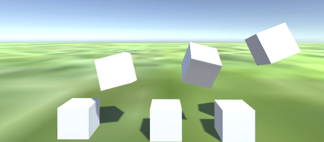
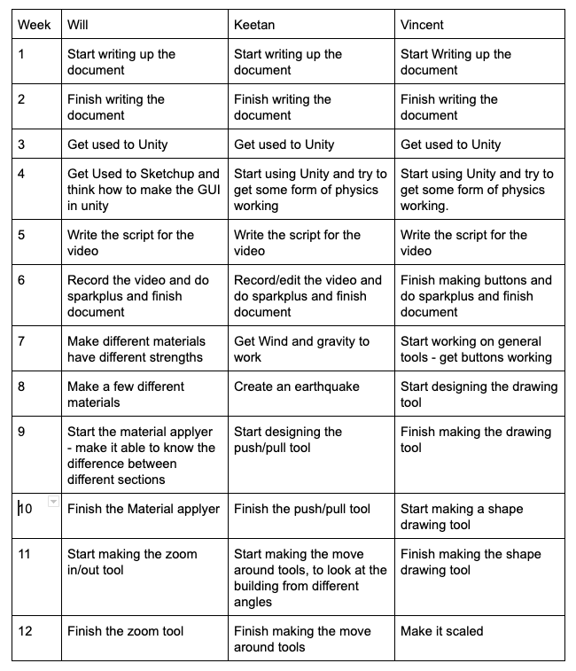

<html>

<head>
  <h1> The Droids You're Looking For Group Assignment </h1>
</head>
<a href="#scroll">Links to each individual website</a>
<a href="#team">Team Profile</a>
<a href="#ideal">Ideal Jobs</a>
<a href="#industry">Industry Data</a>
<a href="#it">IT Work</a>
<a href="#IT">IT Technologies</a>
<a href="#Project">Project Ideas</a>
<a href="#reflection">Group Reflection</a>

   <body>

 <h2 id="scroll">Links to each individual website</h2>
  
<a href="https://vincentsingzon.github.io/myprofile/">Link to Vincent Singzon Profile</a>
My name is Vincent Singzon my student ID is S3818849, I’m from Sydney Australia and my background is Filipino, my hobbies include things such as gaming, going out, art and working out. II joined this course as I have an interest in IT due to my hobby of playing games and my Dad who also works in IT related field. The IT field I'm particularly in is Cybersecurity which I hopefully get employed in, my experience includes a completion of a Cert IV Networking course in Tafe and some programming, along with this course.

 

<a href="https://keetansouthwell.github.io/ITP-Assignment-1/">Link to Keetan Southwell Profile</a>
My name is Keetan Southwell, my student ID is 795652, my email address is keetan.southwell@gmail.com. I am a year 10 student and live on the North Shore of Sydney. I was born in Canada and moved to Sydney when I was 7. I have one Golden Retriever named Ryder. My hobbies include basketball, video games and puzzles.

<a href="https://github.com/WillDaWise/Assignment1/wiki">Link to Will Grime Profile</a>
I’m Will Grime and my student number is s3795662. I am a year 10 student at St Ives High School in the Sydney North area. I enjoy video games and basketball. I enjoy coding, and my IT experience is just my IT electives at school, along with Intro to programming and programming 1 from RMIT which I have just completed. 
<h2 id="team">Team Profile</h2>
<h3> Keetan Southwell </h3>

When I’m working in a team, my behaviour will be influenced in a contradicting way. This is because I have an introverted personality, but I also have a need to be in control. This means that while working with people I don’t know, I will have a need to convey my ideas, but will have no way to actually convey them because I am too introverted and I can’t do it efficiently or confidently. I should also consider that I become distracted easily, but am quick to get back to work. If I am not able to fidget or do something while I work, then I may not be able to concentrate on the work. Because of this, I should consider my likelihood of either become agitated or distracted in a group situation. I should strongly consider my ability to not see other people’s solutions as well, since I can get caught up in planning my own solution to a problem and then push this idea, instead of listening to other people’s solutions.

 
<h3> Will Grime </h3>

These results are very influential for my participation and behaviour in a team. I now know that I have to work harder to emotionally connect with people that I am in a team with. This is from the 16 personalities test. Since I have a highly logical mind, from the 16 personality test again, that I be assigned to tasks that require logical thinking. If I need to learn things while in the team, then I also need to use visual techniques to do so. 

 
<h3>Vincent Singzon</h3>

The results show i'm a tactile learner, that i learn things better through hands on approach, how i tend to take frequent breaks having difficulty sitting still these results could be helpful to the group as i like to do hands on things such as designing a website, using computers as they reinforce a sense of touch and that i learn best by doing the task not just reading, seeing or hearing.
 

<h2 id="ideal">Ideal Jobs</h2>
<h3> Vincent Singzon </h3>
 My Ideal job Is Web Developer. A job which is a programmer that specialize in the development of World Wide Web Applications

<h3> Keetan Southwell </h3>
My ideal job was as a civil engineering project manager. The common elements I found in this job are the impacts that IT has on it, in that the job is drastically assisted by IT. It is different in the sense that it is not specifically in the IT field of work. My career plan is very different to others in the group. 
<h3> Will Grime </h3>
 My ideal job was to be a junior data scientist. The common elements I found in the jobe was the use of IT to complete the job, as in the use of coding languages such as R and Python. The difference of this job was that it was largely about the use of data and maths to help businesses in real time. My career plan is similar to others in that I want to complete University, and then get different jobs to obtain the skillset I would need.
<h3>Kyle Molloy</h3>

My ideal job is ICT system administration maybe seeing where it takes me or see what insights it can give me and help me discover what I would enjoy doing whether it be completely different to this. A chilled work environment with a bit of banter and a supportive team behind you to turn to for help if need be is ideal but also something that challenges you that little bit each day and makes you use your brain, I tend to get bored easily so something I’m interested in that still gives a bit of a challenge I think would suit me well.
I believe for this position you need 3 years’ experience in ICT system administration work and Tertiary qualifications in ICT or computer science or relevant industry certifications, Experience in enterprise network infrastructure, visualization technologies, active directory and windows server, backup and recovery, system monitoring and alerting. Experience in Microsoft Azure, Office 365, Zoom, Trello, Slack etc.

<h2 id="tools">Tools</h2>

 Link to repository: <a href = "https://github.com/VincentSingzon/Group-Website" >https://github.com/VincentSingzon/Group-Website</a>

 Link to GitHub website: <a href = "https://vincentsingzon.github.io/Group-Website/" >https://vincentsingzon.github.io/Group-Website/</a>

 The GitHub trail doesn't entirely reflect the work and planning that has gone in to this assignment. Our group used other tools such as the discussion forums via Canvas, a shared google doc and discord to communicate our ideas for this project. GitHub was worked on last out of most of these tools, with planning being done though other means. Thus, GitHub doesn't accurately reflect our group's work patterns.

<h2 id="industry">Industry Data</h2>

<h3> Demand Ranking </h3>

The rest of our ideal jobs are not listed on the burning glass data.

<h3>Required Skillset</h3>

Because our ideal jobs for our group were so varied, some being in the IT field, others not and some being in between these two, we were unable to come up with one set of ideal skills required for our group. This does, however, add more diversity to the group and makes our team stronger, since we all have different skills.

<h3> Vincent Singzon </h3>
My ideal Job cyber security anaylst is in large demand as their is currently a shortage of skills related to cybersecurity that cost Australia $400 million in lost revenue the skills required for the role would be IT skills like programming, networking communication and presentation skills, problem solving. The three highest ranked IT specific skills that are not required skillset are 
Business Management, Business process and Building relationships. The three skills not in my skillset are Python, Graphic design and Javascript.
<h3> Will Grime </h3>
My job of juniour data scientist, which probably has a moderate to large demand from employers. The technical skill that is needed, Python, is not in great demand from employers. However, communication and presentation skills along with problem solving skills are the top two non specific skills in terms of demand. The three highest ranked IT skills that aren't required for my job are SQL, Javascript and Java. The three highest ranked non IT skills that aren't required for my job are organisational skills, writing, and teamwork/collaboration. After looking at the burning glass data, my opinion of my ideal job hasn't changed much. It has changed to also include skills that are in great demand. This is because I want a job where the skills can be helpful to get more jobs and can be applied in other areas.
<h3> Keetan Southwell</h3>
 The skill of project management in my ideal job ranks fifth in the list of desired skill by employers. The general skills that are required in my ideal field rank among the top, with communication, problem solving and organisation being the top three skill respectively and teamwork and planning also being ranked highly on the list. The three highest ranked IT specific skill that are not in my required skillset are SQL, JavaScript and JAVA, which are the three highest ranking skills. All of the generic skills need to be had in any job to make a person successful, however the least useful ones in my required skillset for a project management job would be creativity, presentation skills and self-starter. Having looked at the burning glass data has not changed my ideal job, since it is not in the IT field to begin with and the burning glass data is geared specifically towards IT careers.

<h2 id="it">IT Work</h2>
<h3>Professional Interview</h3>
 
 The IT professional we interviewed is in the business of telecommunications. He does software, firmware and hardware testing, as well as project management in the telecommunications field. He interacts daily with the company management, software and hardware engineers, software testers, documentation workers and customer tech support. He mainly spent his time at work at a desk or in testing labs in an office building. The hardest part of his job was said to be the making judgement calls on whether or not to ship a certain project and making decisions about the readiness of certain projects for customer consumption. He said this was the ardest part because if he made the wrong decision, it could come back on him from his supervisors in either case, where a product was shipped too early or too late.
<h2 id="IT">IT Technologies</h2>
<h3> Autonomous Cars </h3>
 
<h3> What Does it Do? </h3>
 This technology is mainly still under development in most areas. While cars are not yet fully autonomous for public use, many cars have autonomous features such as automatic or driver-assisted parking and even an intelligent cruise control system that will adjust to the changing traffic conditions of the road. These systems are the first steps towards a fully autonomous car in the future and a lot of the pieces of an autonomous car exist, however, they need to be fully assembled to make a proper car that can drive itself. Even technologies such as the car knowing when it needs fuel, where it needs to go and when the tyre pressure becomes too low for the car to operate safely have been developed. Autonomous cars can be classed into 6 different categories, from fully human operated at level 0, to fully autonomous at level 5. Level 1 cars allow the car to preform 1 autonomous task at a time. These tasks include automatic lane keeping or automatic cruise control and require a driver. Level 2 cars can perform 2 autonomous tasks at any given time including steering and automatic braking, or cruise control. The driver must still be in control of a level 2 car. Level 3  cars will be self-driving under good conditions and inside of certain areas known as geofenced areas. Level 3 cars still require a driver to take over if the car is no longer able to drive itself. Level 4 cars are full autonomous under certain road conditions such as weather, terrain and speed. If the conditions become too poor for the car, the driver must take over. Level 5 cars allow full control to the car and no driver being needed. While dealers such as Audi and Tesla have achieved level 3 automatic cars, there are no available cars with automatic capacity greater than 3, with no cars in categories 4 or 5. Despite this, Google,  Zoox and Tesla are working towards a fully automatic car in the near future. Zoox is leading this charge, with their company being full devoted to the goal of making a level 5 driverless car. As previously mentioned, a lot of the technologies for a fully driverless car already exist today and have been properly implemented into the cars. There are very few new technologies that need to be developed in order for driverless cars to work, besides the removal of the need for the geofences that allow today’s automated cars to operate. The technologies that may be needed include better 3D mapping software to allow cars to track hazards more effectively and to track the terrain that they are currently operating on. Cameras which have a night mode, such as Apple’s new IPhone 11 camera could also help to detect terrain under dark conditions such as night or during storms. In the next 3 years, this technology may be applied to the driverless cars of today, to make them full autonomous under any conditions. We may possibly even see networks of interconnected cars that communicate with each other to make the roads a safer place to drive. Driverless cars are here, and in the near future we could be seeing many more of them on our roads, with technology for them being reapplied in new ways.
 
<h3> What is the Likely Impact? </h3>
There is a drastic impact to be had from this technology. With cars finally becoming driverless, it eliminates human error from the road. Driving under the influence of drugs or when tired would be eliminated, since nobody would be driving anymore. These factors being eliminated would make it much safer for people to be on the roads. Travel times may also decrease, with computers needing less time to make decisions than a human would, meaning corners could be taken faster, cars would need less than a three second gap between them, traffic conditions would be automatically mapped so the computer would take the fastest route, and many more improvements to the roads. Everybody is most affected by this change. Most people in the world today, and especially in Australia, own a private car, and the ability to make your car driverless would mean that people have more time when they travel to work every day to do things other than drive. Court cases involving driving accidents would be drastically reduced in time and number, since the cars would constantly monitor their surroundings and everything would likely be recorded. With cameras, police would easily be able to see exactly what happened to cause a crash. The one downside of the driverless cars is the people who make a living off of driving. This could include taxi drivers, bus drivers or others. It’s not just the people who drive for a living that could be made redundant, traffic police may also lose their jobs, or have those jobs reduced in number, since they wouldn’t have to preform RBTs, check cases of speeding and running red lights, and check for cases of using a phone while driving. There could be new jobs opening in the development of this technology, as more dealerships move towards driverless cars.
 
<h3> How Will This Affect Us? </h3>
 This may affect us in drastically different ways. Some families may do a lot of driving, my father is always incredibly tired at the end of the day, since he spends most of his day driving around. This would help him to not be as tired at the end of the day and fulfil his main day job of renovating our house. It would allow me personally, to travel to a friend’s house easier and without the need for my parents to drive me, since I still only have a learner’s licence. Overall, autonomous cars would have a large impact on us and the people around us, however the variation in these impacts would be limited. There is little personal impact to be had from this new technology as everyone is mostly affected in the same ways, having faster and better transport that is also more efficient.
 
<h3>Cybersecurity</h3>
 
<h3>what does Cybersecurity do</h3>
Cyber Security is the protection of computer systems from theft or damage to it's hardware, software and electronic data. The field is becomnig more important due to increased use of computers systems, the internet, wireless technologies such as wifi and bluetooth and the increased use of smart devices such as smartphones. To protect systems Cybersecurity uses vendors
Vendors in cybersecurity would use endpoint, network and advanced threat protection security as well as data loss prevention. Three commonly known cybersecurity vendors include Cisco, McAfee and Trend Micro. Cisco focuses on networking and allows customers to utilize firewalls, vpn and advanced malware protection along with supporting email and endpoint security and  also realtime malware blocking. Mcafee makes cybersecurity products for consumers and enterprise users, it supports mobile, enterprise cloud, network, web and server-based security also offering data protection and encryption Trend Micro is an anti-malware vendor which offers threat protection for mobile, hybrid clouds, SaaS and the IoT. Trend Micro provides users with endpoint, email and web security. what is likely to be done soon as a reponse to increased cyber security threat is New job title appearing such as (CCO chief cybercrime officer).
 
<h3>What is the likely impact?</h3>
  As people are being exposed more to technology like smartphones and computers there is a greater emphases on protecting users from cyberattacks such as computer viruses, date breaches and denial of service attacks. What is likely to change in the future is the increased need to protect computer systems as they can be a big deal, able to cuase things such as blackouts, stealing personal information, and breach of security like military equipment and disruption of computer systems and phone services. The people who will most likely effect would be anyone who uses technology in their daily lives. This field will create new jobs in the future as it is a growing field and buisness and government wanting to hire people specialized in this field. New titles appearing such as cybercrime officer. 
<h3>What does it do</h3>
This will affect me as a lot of my life revolves around technology, it will affect everyone as well as we rely on technology in our daily lives. What will be different is that cyber criminals are able to target things such as medical technologies like pacemakers, hack into military installations stealing sensitive data and have terrorists disrupt power grids or phone lines and as the world becomes more digital we need people who are able to protect consumers and business from cyber threats. 
=======
<h3>Machine Learning</h3>
 
<h3>What Does it Do?</h3>
Machine learning is the ability of machines, robots, and computer programs to use data to learn. It essentially uses data to improve the reliability, usefulness and accuracy of computer programs. Machine learning is often interchanged with artificial intelligence, however, artificial intelligence is where computers are given human characteristics, and machine learning is the method that the computer uses to do this. Machine learning uses large, diverse, complex data sets and analyses it, learning from it, identifying patterns and making decisions based on the data. This data could be the surroundings of the computer, and be analysing it as it comes in, for example autonomous vehicles. The data could also be from the past, such as a chess machine analysing how chess masters have played in the past. To conclude, machine learning is the analysis of data by a computer to improve a computer.
  
There are currently many different areas of machine learning, such that there isn’t really one ‘state of the art’ of this technology. Machine learning can be seen in almost all areas of society. This includes anywhere from google, to autonomous cars, to stock analysis. This technology also isn’t that new. The first Machine learning started in the early 1950’s, with computers being able to convince humans that they were human, and a program of checkers that learnt as it ran. The current state of the art for one part of machine learning is probably google’s search algorithms, and various other algorithms that have ‘suggested’ items. Another state of the art part of machine learning would be autonomous cars, Siri and similar chatterbots, and the code in humanoid robots such as the Honda ASIMO. To sum up, there are various state of the art machine learning technologies.
  
At the moment, machine learning can analyse data, come up with solutions to problems, help customise user experience, and assist in autonomous vehicles and systems. It can currently customise user experience, such as in youtube’s ‘suggested’ videos, or google’s autofill. It is also used in autonomous cars to get data from all cars and share it to other cars, thus enabling learning from one car to be passed to others. Machine learning in chess programs can also learn a particular players’ playing style and adapt its strategy to play against them. 
  
Over the next three years, machine learning will hopefully keep improving. However it is unlikely that it will reach the levels seen in sci fi movies and TV. It is likely going to be able to win very complex games such as chess go, however it is unlikely to be able to be able to maintain a house. Machine learning will probably greatly improve in chat bots, as more data will be coming in that will be able to help the programs. Autonomous cars are likely to be completely road safe, however whether they will be legal or not is a different question. The technological advancements that has made machine learning possible is the complex algorithms that have been developed to recognise patterns, make decisions, and to learn without human intervention. Another technology that has greatly helped is the development of systems that can produce large quantities of data, such as sensors, and the internet. This has enabled machine learning to use this data to improve itself.

<h3>What is the Likely Impact?</h3>
  
    The likely impact of more advanced machine learning is more automation in almost every aspect of our lives. There will be more automation in manufacturing, security, driving, healthcare, and many others. Robots will likely take over many jobs, such as manufacturing and drivers, as the need for humans will become less and less. Another likely impact is less need for manual labour. With machine learning, machines can learn how to perform manual tasks, and possibly even be better than humans. Machines can also be specialised to perform certain tasks and are not limited in strength, thus replacing costly humans. However, in developing countries, sadly, this technology may not be affordable, and manual labour will still be needed. A potential impact of this technology would be that instead of manual labour and manufacturing being outsourced to developing countries, it may just be outsourced to fully automated factories in developed countries. The lives of people in developed nations is likely to change greatly. The new automation is likely to create more wealth in developed nations. This will probably create better lifestyles in the upper class, however, there might also be higher rates of unemployment, which may cause higher levels of mental illness and suicide. The people most affected will be the people who perform manual labour for their job. It may create new jobs, but it will certainly largely replace the need for manual labour. However, everyone’s lives will be changed by the implementation of autonomous vehicles. This will free up time for many people, as in their transit to work they will be free to do what they want. To sum up, Machine learning will replace and change many aspects of our lives. 
  
  <h3>How Will this Affect You?</h3>
  
    Machine learning will affect me greatly. Since I have, am, and will be growing up as this technology improves and becomes part of our lives, it will likely have a large impact on my life. It will affect the jobs that are available for me, and change the way that I view the world. On most days, I catch the train and bus to school. Potentially, in the future, these systems won’t require train and bus drivers, thus changing everyone's lives. Machine learning may also affect how teaching works. For example, there may not be a need for a teacher anymore, due to an AI created by machine learning taking the role of the teacher. When I get a job, it may mean that I will be working more with computer co-workers than human ones. For each member of my family, it will be different. My mum, who is a teacher, may experience her job changing quite drastically. For my dad, his job probably won’t change much, since he works in management. For my grandparents, there will be a great effect on healthcare. They will probably have access to healthcare from computers that they wouldn’t have had 10 years ago. For my friends, it will mean different things for all of them. It will definitely affect what courses they choose for Uni, and also what career paths they want to go into. The main reason that machine learning will have a great effect on me and the people around me is that we live in a developed country. To conclude, machine learning will greatly affect my life and the people around me. 
  
  <h3>Internet of Things</h3>
  
One of the most promising technologies we are using now is internet of things (IOT) technology which connects several devices and makes a virtual network in which several devices works under single monitoring system which includes your mobile phone, refrigerator, washing machine and other home appliances.
Internet Protocol version 6 (IPv6) is the latest revision of the Internet Protocol (IP), this is the communications protocol used to identify and locate systems for computers on networks and routes traffic across the Internet.Every device on the Internet are assigned a specific IP address in order to communicate with other devices which can be changed or with use of VPNS determine you to be in different locations as a security precaution due to new the ever-increasing number of new people and devices being connected to the Internet, the need arose for more addresses than IPv4 is able "The User Datagram Protocol (UDP) is one of the core members of the Internet protocol suite (the set of network protocols used for the Internet). With UDP, computer applications can send messages, in this case referred to as datagrams, to other hosts on an Internet Protocol (IP) network without prior communications to set up special transmission channels or data paths."to accommodate. IPv6 uses a 128-bit address.
"The User Datagram Protocol (UDP) is one of the core members of the Internet protocol suite (the set of network protocols used for the Internet). With UDP, computer applications can send messages, in this case referred to as datagrams, to other hosts on an Internet Protocol (IP) network.
"The Transmission Control Protocol (TCP) is intended for use as a highly reliable host-to-host protocol between hosts in packet-switched computer communication networks, and in interconnected systems.

These are just a few examples given of IoT which are used everyday to help connect us to the internet and transfer information and send messages to one another as IoT ranges from your mobile provider which connects you to your data plan to the radio frequencies used to transmit sound delivered to your radios we tune into day to day. Bluetooth, NFC are another form, technology has advanced so much that if it was taken away tomorrow the world including myself wouldn't know what to do with themselves and businesses, everything using technology would crash not to mention our money would be lost for those investing in online currencies such as bitcoin.

One of my personal favourites would probably have to be cloud storage as it makes life so much easier being able to upload files, photos, documents to online storage and be able to access it no matter what device you are using, I have more than one computer as well as a mobile device and a Ipad I am able to grab and upload or download from by using One Drive and that is extremely useful with my studies as I can work on it no matter where I am and grab it from any device.

Ideally technology makes our lives so much easier and without it people would be without jobs, people wouldnt be as obese as they have to leave the house me included haha and I wouldnt be able to destroy noobs at call of duty and uber eats food directly to my door.

 <h2 id="Project">Project Ideas</h2>
<h3>Overview</h3>

The project to be designed is a 3D modelled physics engine with real world physics in it where it comes preloaded with certain materials that you can insert and test in a 3D space. Essentially the program will act similarly to Sketchup or other 3D modelling software, except it can take into account real-world physics at work, such as wind and aerodynamics, building load, stress and strain on materials and the weight and structural integrity of different, pre-generated materials, ranging from all different types of concrete, to cables and steel beams. The program will mainly be used as an assistant to engineers so they can see in real time roughly what happens to their proposed ideas if they were to be constructed in the real world.  

The outcome of the project should be a large decrease in building failures because of the physics engine of the system. This would solve the original problem of there being too many building failures in cities. The program would also be a great way to teach engineering students about building technique without wasting materials or time on physically building structures. In the real world, there is no room for testing and experimentation, but this program would allow for this. There may be new developments because of it, as new building materials were tested by different users of the program.

<h3>Motivation</h3>

Residents of Sydney’s Opal Tower were evacuated when the building began cracking on December 24th 2018. Following this cladding fires swept up the Neo200 building in Melbourne in February of 2019 and Mascot Towers in Sydney were closed due to cracking in June of the same year. This shows that there has been a major crisis in the structural design of buildings in recent years and a program that modelled scenarios that these buildings may undergo. The scenario generator would have the building be tested before it went up over time and thus eliminate all of these possible areas of failure.

<h3>Landscape</h3>

The project being created incorporates a number of different aspects of existing programs, however there are no programs available that can do what the proposed project will be able to do. Software such as SketchUp can model the building of structures in the same way that the proposed program will be. Physics engines also exist, in the form of game development software such as Unity, which easily applies the desired physics to an object with the application of a rigidbody to the object. While programs do exist that run components of the full program, the full program doesn’t exist anywhere. Because of this fact, there wouldn’t be any true competitors to the program.

<h3>Aims</h3>

The aim for this project is to create 3D modelling software and Physics engine that can simulate buildings and weather conditions to assist architects in designing their buildings. We will do this by using Unity, and we will attempt to make something similar to sketchup with the addition of a material applyer tool. The goals that we’ll need to achieve to do this are to create the tools similar to sketchup, create the physics, and to create the different materials. 

To create the tools similar to sketchup, we need to make things in Unity that can draw lines and shapes, push/pull, zoom, move around, and orbit tools. There also needs to be buttons made so the user can switch between tools. The drawing tools will need to be able to create new objects and rigidbodies inside the program. The orbit, zoom and move around tools will need to be able to change the camera’s position and zoom, and will probably be methods inside the camera class. 

The physics will also need to be applied. This will involve gravity, wind, earthquakes, hurricanes and so on. For these to have an effect on an object, the object needs a rigidbody. This means that it can react to gravity, which is inbuilt, as well as addForce(int) methods, and be able to react to particles hitting it. The earthquakes will involve addForce(int) methods being applied to the ground, and the Hurricane physics will need wind and particle physics. 

The goal of having different materials is the main part of the project. This will first entail the ability of a material to have different characteristics, such as the structural integrity, the tensile and shear strength of the material, porosity, flexibility and resistance to air pressure. These will then need to correspond to pieces of code that tell the object what to do under certain circumstances, such as pressure and force that is applied to it. The program will also need to be able to apply these properties to different sections of the building. 

<h3>Plans and Progress</h3>

The program would first have to model the most common building materials for houses, skyscrapers and bridges. These would be as follows: reinforced concrete or regular concrete, steel in a variety of grades and different premade structures, such as I-beams, and vertical supports. The program would also have a variety of rock choices for exterior structure and decoration in the form of granite, marble, sandstone and limestone, or some cladding such as aluminium. The program could also factor in windows, and the structural integrity of those windows. Materials that would also make up the interior of the building would also be rendered. These materials would include gyprock, different size wooden studs or certain kinds of insulation to factor in the changes with heat that may be undergone. The rendering of each of these materials in the program would allow for the necessary variation of materials to effectively construct a building, bridge or other structure that is functional in the program, and in the real world.
The program would allow you to construct the building in a similar way to how Sketchup would construct a model or building. It would have all of the same tools, such as drawing tools, push and pull tools, measuring tools etc, except the paint tool would allow the user to instead of just colour a surface with the desired texture, to alter the physical properties of the structure. These include the structural integrity, the tensile and shear strength of the material, porosity, flexibility and resistance to air pressure. The tools of SketchUp would allow the user to construct a building using an already existing interface. Not only would this allow for the program to be easier to code and prototype because of the existence of a program similar to it, it would also allow for a more universal type of GUI that most users would be familiar with.
The ground could also be changed in the simulation to different materials such as slate, sandstone, disrupted sand, or bedrock. It would also have an option for the ground to be a solid block for testing purposes without the ground. The ground is an important feature, especially when combined with the simulation’s ability to take into account weather because it would take into account scenarios such as frost heaving, rock becoming weaker when it rains, among other scenarios where the ground shifts and changes over time.
The simulation could model the weather in the simulation as well, even being able to model extreme weather such as hurricanes and flooding. Although it is likely that extreme weather would cause irreparable damage to a building, the simulation could model the effect this weather would have in an attempt to minimize the damage the structure receives. Extreme winds can cause bridges to collapse when their resonant frequency is reached. The simulation would help to prevent cases of this from happening. This would help determine the aerodynamics of the building. The building would have the ability to sway naturally in the wind like modern day skyscrapers do so it won’t fall over or crack from being too rigid.
The thermodynamics of the materials would also be taken into account, leading to the simulation being able to take into account the expansion and contraction of the structure under different heats. Concrete, for example, expands less than aluminium, and unless this expansion an contraction is taken into account, any modules of the building which expand more or less than others, risk separating.
The program would have a run button inserted into it, where when pressed, would apply the physics to the simulation. The simulation, when the physics were applied, would make it so all surfaces would fall as they would towards the ground in a real world scenario. When weather is factored in, the ground and building interacts with the weather as it would in a normal scenario. For example, this can include the weather being rainy, thus, the slate in the ground would turn to clay. From this, the foundation would need to be more stable to compensate for this difference in the ground. The simulation would also test to see, at the same time as the ground difference, if the building would be affected by any wind in the area at the time. This real time application of the physics would make it so the
All of the factors working at the same time would determine if the building, with its given materials, would undergo any failures such as cracks, damage, or loose pieces. This would all happen in real time as well. As the simulation progressed, the user could adjust the speed, to see if the building would hold itself over a number of years under pre-programmed circumstances. All of this would help to determine the long term circumstances that the building underwent.
The most useful feature of the entire project would be the ability for the project would be its uses as a teaching tool. It would give the user some basic lessons in building construction, such as how to correctly implement a foundation for a building, what type of foundation would be needed for different ground types, what materials that are available are best for which function, the height to base ratio that is need for different structures, the load bearing strength of different structures and many more teaching functions that could be used to properly instruct someone how to build a building. It would also have the functionality to display the current stresses undergoing one material segment when hovered over with the cursor. Each segment would be clearly highlighted in a coloured outline for ease of use and the stresses would appear in a corner of the screen. This is by far the most useful feature of the entire program because it can be used as a tool to teach new engineering students and architects about real building techniques on a large scale, without using real materials, time, or placing anyone in danger.
Some prototyping was done in Unity to test the physics engine that is already available.  Screenshots are provided below. The prototype tested the gravity physics and wind physics in the simulation, as well as modelling materials of different weights and how they interacted with each other.
  
  
  

<h3>Roles</h3>

In our group we decided not to have specific roles. This was mainly because we only had a few people in our group, but it is also because none of us had much experience in anything. Consequently, we will all be doing similar things to each other, we will all be writing up the project document and the script for the video, however Keetan and Will will record the video because they can easily meet up. All of us will also be using Unity to complete our project. Our process will be we are all working on different parts of the project, but all of them are similar, and then in the last week or two of the proposed time we would consolidate the sections of the project. We don’t have specific roles because there is no specific tasks that need a particular role. 

<h3>Scope and Limits</h3>

The main aim of our project is to create some software that can test the structural integrity of a building. This means that the most important part would be to get buildings able to be made with different materials and be able to test the structural integrity of the building. This means the scope would probably be to just get this working, although ideally it would be to get a sketchup-esque program working. The scope is to be able to create a building that uses material properties to determine if it is structurally sound. There will be a limit on how nice we can get it to look and how well it determines structural integrity There are other limits such as our ability to code new features. The general limits is the basic prototyping that we did in Unity, which is all the coding that we know how to do.  

<h3>Tools and Technologies</h3>

Unity Version 2019.2.12f1 - personal edition - free if the profit is less than $100,000
    Keetan and Will have had some experience creating a game with this software.
Premiere Pro version 14.0 - Keetan has used this before to create videos 
Github - all have experience from assignment 2
Google docs - all have experience from assignment 2

   

Our Github trail says that Keetan put everything on the website at the same time. However, this is not reflective of the groups efforts as most of the work was done on a google doc. The edit trail on the google doc however, is a better estimate of our work, although still not very accurate. It says that Keetan only edited a few times, Will edited a lot, and all three of us were editing on the Sunday it was due. However, Keetan’s edits were larger, and Wills edits were very small. In fact, Keetan did more work that Will and Vincent. 

<h3>Testing</h3>

We will test our project by testing the various physics components in Unity. We will create situations while we are doing the project where we can test the various elements of our project in Unity. We will know that we have succeeded when it works and everything does what its supposed to do. There will also be a fair bit of testing as we go, small checks to make sure each little section of code works. Our project will not involve user testing, so we don’t have to worry about finding test users. 

<h3>Timeframe</h3>

<h3>Risks</h3>

There are a few risks that we might encounter. These include difficulty in creating the physics, the computer not being able to handle what we are trying to do, and it actually being impossible to do with Unity. It might be quite difficult for us to create the required physics, as we don’t have much experience in this area. It also might be too much for the computer to handle, after all, we will be asking it to simulate a large number of physical interactions at the same time. It may also not be possible to simulate the required stuff in unity. We may be using the wrong software to create what we are trying to. The risks we might encounter are difficulty to create physics, it being too much for the computer to handle, and having the wrong software for the job

<h3>Group Processes and Communications</h3>

We have a discord server on which all of our communication will happen. Our meetings will take place once a week on the weekend on our discord server. Group members will be expected to go on the discord at least twice a week outside of this meeting. If a group member does not respond we will just do their part for them, as otherwise we will lose marks. However, if it is evident that a group member isn’t participating in the course and assignments, we will move to a new group to avoid losing marks for sparkplus like we did last time.

<h3>Skill and Jobs</h3>

Lead Developer 
Someone with a technical expertise in using  video editing software such as adobe
Has experience using engine such as Unity 
has leadership qualities and management techniques and innovative thinking
able to work in a team environment
good communication skills

Civil Engineer
management skills
analytical thinking
good communication skills
able to think critically 
knowledge of building stuff
Has coding skills in Python, c#, Java

Project Manager

has strong leadership qualities and management techniques 
good communication skills
is able to negotiate 
has an understanding of the project 
is able to take risk 

User Design Consultant

Has coding skills in Python, C#, Java
Is able to communicate visually 
Able to design interactively 
Has user empathy 
Good communication skills

 <h2 id="reflection">Group Reflection</h2>
  

We did not perform too well in this assignment as a group. However, what went well for us was that we got everything done, and that Keetan and Will were able to collaborate on the filming to get most of it done ahead of time. A major thing that could be improved is our time management. Vincent and Will did not manage their time very well, leaving most of the assignment to the last minute. Our communication was also not that great, which resulted in poor planning and heightened stress closer to the due date. Our poor communication was probably due to unresponsiveness from group members. It was quite hard to do a group project online, as we all had different schedules and couldn’t communicate easily. One thing that was surprising was how fast we could get the last bits done once everyone put their minds to it. One thing I have learnt about groups is that the key to success is good communication of assigned tasks.

 
The assignment was mainly a solo operation until the final night when we all consolidated our individual parts that we had done. Time management in this project was done very poorly. None of us had good skills to manage time, which lead to a very late Sunday night to submit the task. The remaining pieces did come together very fast once everyone communicated, which does show that teamwork is a very important part of the task. Until the final few hours, communication was very poor.

 
We all done our part in the assignment although I didn't contribute to the project like the other members as much as I should have.  Also working together in completing the assignment would be better for the group instead of mainly doing it solo. 

 
<h1> Bibliography </h1>

 Zoox. 2019. Zoox. [ONLINE] Available at: <a href ="https://zoox.com/"> https://zoox.com</a>. [Accessed 12 October 2019].

 YouTube. 2019. What are Geofences? - All about Geofencing in 5 min - YouTube. [ONLINE] Available at: https://www.youtube.com/watch?v=oklOTx_jnbA. [Accessed 12 October 2019]

  
Kathleen Walch. 2019. The Future With Level 5 Autonomous Cars. [ONLINE] Available at: https://www.forbes.com/sites/cognitiveworld/2019/06/20/the-future-with-level-5-autonomous-cars/#2419fa3e4382. [Accessed 12 October 2019]

  
CarsGuide. 2019. Adaptive cruise control explained | CarsGuide. [ONLINE] Available at: https://www.carsguide.com.au/car-advice/adaptive-cruise-control-explained-45905. [Accessed 12 October 2019]

  
Driverless cars The benefits and what it means for the future of mobility | The NRMA. 2019. Driverless cars The benefits and what it means for the future of mobility | The NRMA. [ONLINE] Available at: https://www.mynrma.com.au/cars-and-driving/driver-training-and-licences/resources/driverless-cars-the-benefits-and-what-it-means-for-the-future-of-mobility. [Accessed 12 October 2019]

  
Alphr. 2019. Driverless cars of the future: How far away are we from autonomous cars? | Alphr. [ONLINE] Available at: https://www.alphr.com/cars/1001329/driverless-cars-of-the-future-how-far-away-are-we-from-autonomous-cars. [Accessed 12 October 2019]

 Machine Learning: What it is and why it matters | SAS. 2019. Machine Learning: What it is and why it matters | SAS. [ONLINE] Available at: https://www.sas.com/en_au/insights/analytics/machine-learning.html. [Accessed 12 October 2019].

History of Machine Learning. 2019. History of Machine Learning. [ONLINE] Available at: https://www.doc.ic.ac.uk/~jce317/history-machine-learning.html#top. [Accessed 12 October 2019].

What Are Cyber Threats: How They Affect You and What to Do About Them https://preyproject.com/blog/en/what-are-cyber-threats-how-they-affect-you-what-to-do-about-them/ [Accessed 12 October 2019].

EliteDataScience. 2019. 15 Ways Machine Learning Will Impact Your Everyday Life. [ONLINE] Available at: https://elitedatascience.com/machine-learning-impact. [Accessed 13 October 2019].

  </body>

  </html> 

